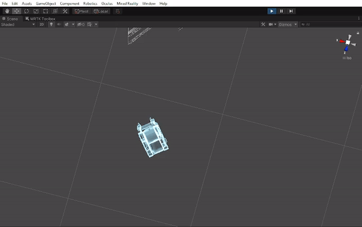
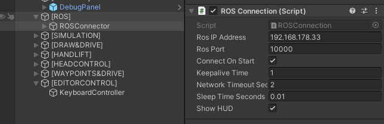
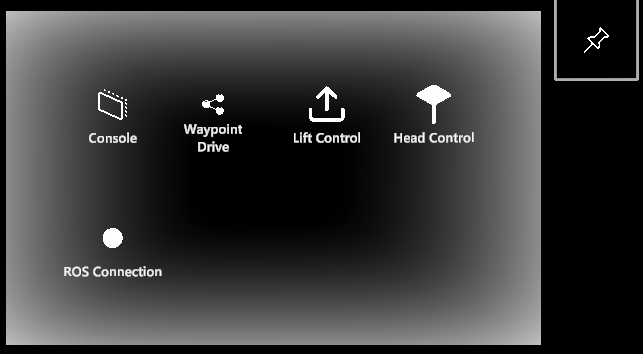
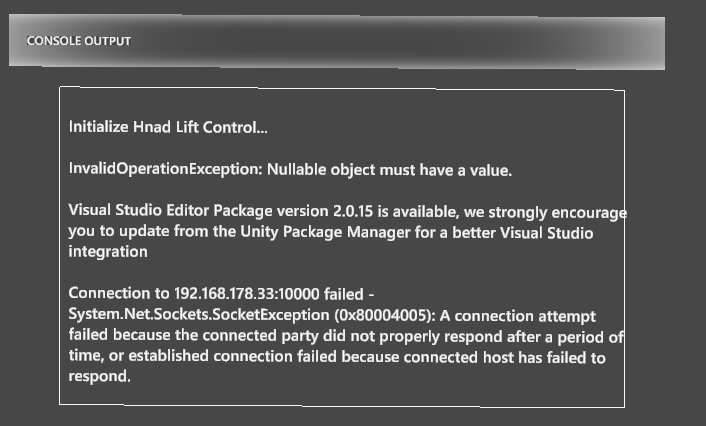
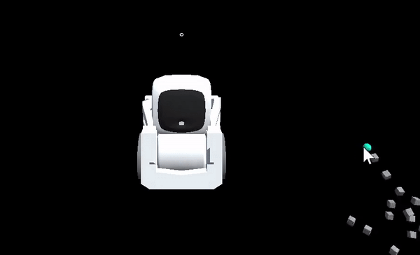
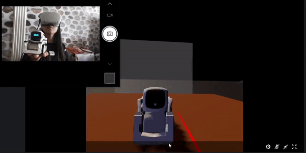

# Unity Setup & Operation Guide

[! Please note that this repository is under continuous development and improvement. Only the functionalities in the ```CozmoMRTest``` scene is working. But please feel free to explore other work in progress code base as well! Feedbacks , contributions, & collaboration is welcome always :) ]

## Testing in Unity Editor

There is a keyboard control functionality from Unity Editor via the ```KeyboardRobotMovementController``` script. Directly run the ```CozmoMRTest``` scene in Editor. 



Command for the robots:

1. Turn right ( right arrow)
2. Turn left ( left arror)
3. Forward ( forward arrow)
4. Backward (backward arrow)
5. alpha 1( turning in place towards left at a given degree angle)
5. alpha 2( turning in place towards right at a given degree angle)
6. alpha 3( driving forward at a given distance )
7. alpha 4( driving backward at a given distance )
8. S ( stop all movement)

The ```ArticulationWheelController.cs``` is the main script managing all the robot kinematics.

## MR Application

1. Setup the ROS IP address ( optional. However, if you would like to experiment with real-time robot control, you need to get the ROS app running and enter the IP address here).




2. Build the ```CozmoMRTest``` scene for Oculus Quest 2. ( Note: make sure passthrough API is enabled, and enable hand tracking). 


All applications can be toggled.

Using the application: 



1. Console: Toggle the debug console.



2. Waypoint&Drive: ask the robot to drive according to a set of define waypoints


3. Lift Control: sync the robot's lift according to the finger distance



4. Head Control: Synchronize Cozmo's head with the head-mounted display's transform.



5.... More features on the way:

    e.g: * draw & drive
         * more dynamics and robust path following algorithm based on forward kinematics. 
    Note: code for robot lift control & image streaming already 

## Build Trouble-Shooting

1. When building for Windows Universal Platform, the original TCP-Connection package does not directly support it. Follow [this github issue](https://github.com/Unity-Technologies/Unity-Robotics-Hub/issues/215) to enable build for the Windows universal platform. 
