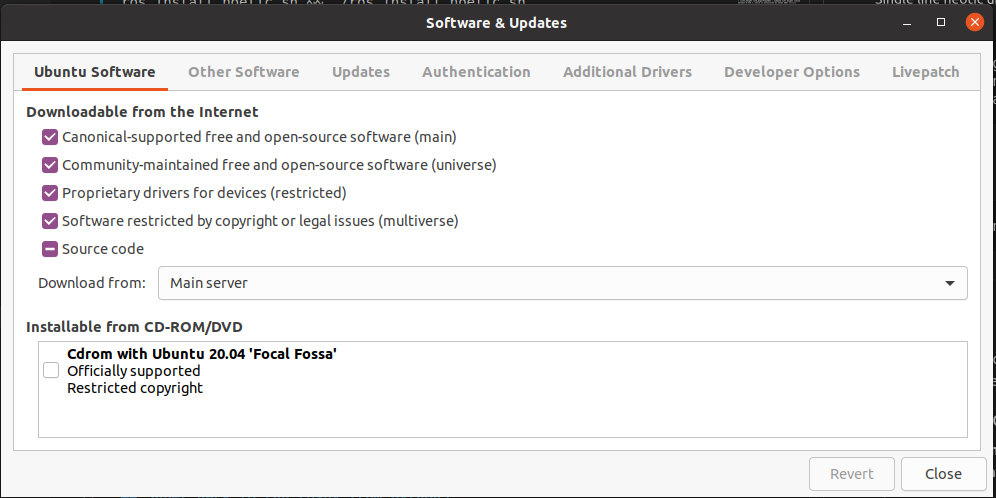
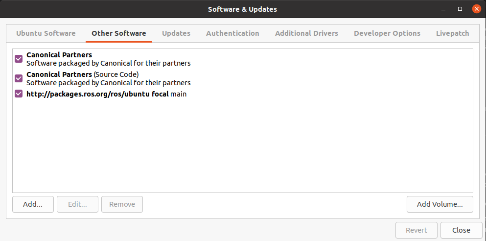
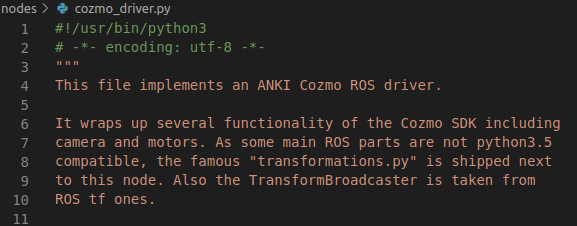
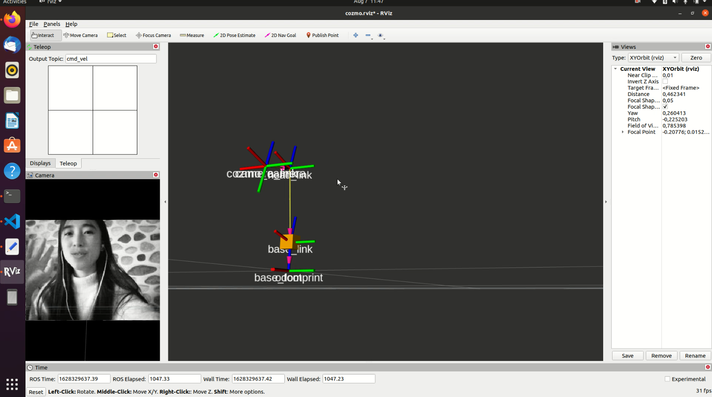

# [Cozmo Driver](https://github.com/OTL/cozmo_driver) Tested on Ubuntu 20.04 and ROS Neotic

This is **unofficial** ROS node for Anki cozmo.

The original repository was last updated in 2017 and is not maintained. However, it is still possible to get it to work on Ubuntu 20.04 and Neotic. This document goes through all the installation process, bug fixes, and instruction of how to run the package.

## ROS Neotic Installation

Simply following the [Single line installation script](https://github.com/qboticslabs/ros_install_noetic)

```sh
wget -c https://raw.githubusercontent.com/qboticslabs/ros_install_noetic/master/ros_install_noetic.sh && chmod +x ./ros_install_noetic.sh && ./ros_install_noetic.sh
```

Single line neotic uninstallation:

```sh
wget -c https://raw.githubusercontent.com/qboticslabs/ros_install_noetic/master/ros_uninstall_noetic.sh && chmod +x ./ros_uninstall_noetic.sh && ./ros_uninstall_noetic.sh
```

Note: 

If you get a:
```
404 package not found error
```
during installation, you might need to check the software&update setting in Ubuntu to enable source code download.






-------------------------------------------------

## Install Cozmo SDK on Ubuntu 20.04.2

First, follow the [official installtion instruction](http://ankisdk.com/list-64.html)

```sh
sudo apt-get install python3
sudo apt install python3-pip
sudo apt-get install python3-pil.imagetk
pip3 install --user 'cozmo[camera]'
```

install rospy:

```bash
sudo apt-get install python3-yaml
sudo pip3 install rospkg catkin_pkg
```

If you get a rospy module not found error, run:

```
source /opt/ros/noetic/setup.bash
```

Also, if your base conda enviornment is activated each time you open a terminal, you might need to deactivate the conda environment, see [here](https://github.com/stereolabs/zed-ros-wrapper/issues/569).


-----------------------------------------

## Install [usbmuxd] ( https://github.com/libimobiledevice/usbmuxd) for IOS Mobile Phone

In order to enable socket connection via ios, usbmuxd is required by the COZMO SDK. Simply follow the official instruction. 

If you get error when running ```./autogen.sh```

```sh
No package 'libplist-2.0' found
```

Fix with maunually compile the following packages. See [issue](https://github.com/libimobiledevice/libimobiledevice/issues/1067).
```
sudo apt install build-essential checkinstall git autoconf automake libtool-bin libssl-dev pkg-config cython libusb-1.0-0-dev
git clone https://github.com/libimobiledevice/libplist
git clone https://github.com/libimobiledevice/libusbmuxd
git clone https://github.com/libimobiledevice/libimobiledevice
git clone https://github.com/libimobiledevice/usbmuxd
cd libplist
./autogen.sh
make && sudo make install
sudo ldconfig
cd ..
cd libusbmuxd
PKG_CONFIG_PATH=/usr/local/lib/pkgconfig ./autogen.sh
make && sudo make install
sudo ldconfig
cd ..
cd libimobiledevice
PKG_CONFIG_PATH=/usr/local/lib/pkgconfig ./autogen.sh --enable-debug
make && sudo make install
cd ..
cd usbmuxd
PKG_CONFIG_PATH=/usr/local/lib/pkgconfig ./autogen.sh --prefix=/usr --sysconfdir=/etc --localstatedir=/var --runstatedir=/run
make && sudo make install
sudo killall usbmuxd

rm -fr libplist/ libusbmuxd/ libimobiledevice/ usbmuxd/
```

TO check if your iphone is connected correctly, you could go to 
```
sudo /var/run/usbmuxd usbmuxd -f -v
```
to see if usbmuxd is correctly install, and bring the log to the foreground with higher verbose level.
 
---------------------------------
## Now Install the cozmo_driver

On Ubutun 20.04 and noetic, you could no longer install directly via ```rosdep install```. A work around to this problem is to download the repo from github, and copy the repo to ```/opt/ros/noetic/share```

Before doing that, we need to setup a few things:

1. Fix the ```camera_info_manager``` packge not found error:

The file which is not included in the original repository and seems to be depricated in the newer version. I just download the file and include it in the nodes folder. 

2. Point the shebang enviornment to correct Python binary on each python node file. 



For simplicity sake I did not create a virtual environment and it is not needed. 

3. Also you could add new nodes, change configurations before copying the folder to ```noetic/share```. 

After everything is finished, you could finally run:

```sh
roslaunch cozmo_driver demo.launch
``` 

if SDK mode is enabled on your cozmo, you should be able to see the application up running:





------------------------------

## How to Setup Communication with Unity

Use [Unity ROS-TCP Endpoint](https://github.com/Unity-Technologies/ROS-TCP-Endpoint) repo, which we need to install on the Linux side to send and receive message to and from Unity.
