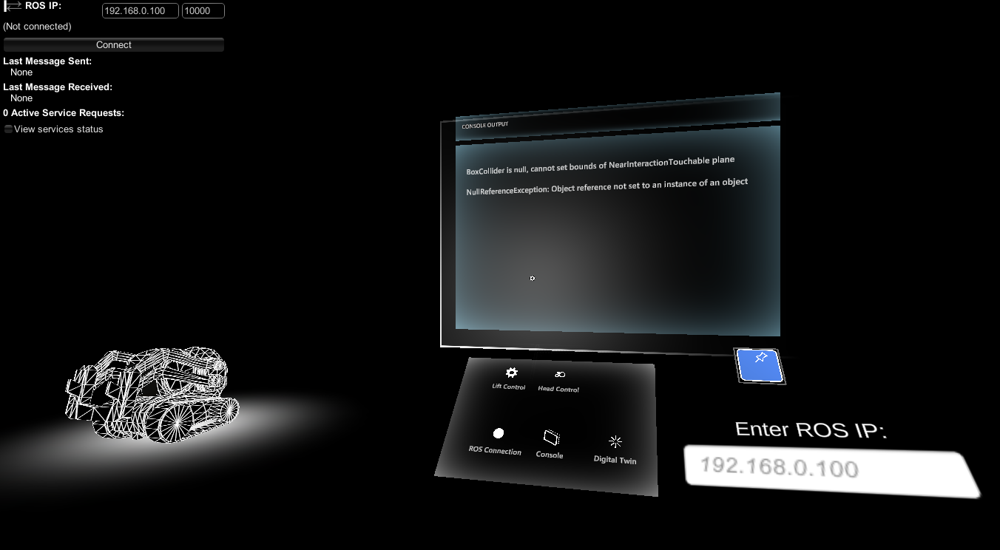
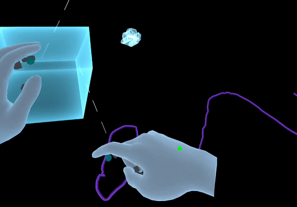
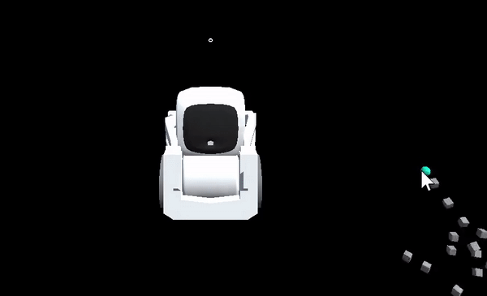
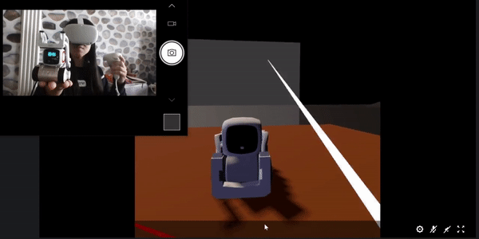
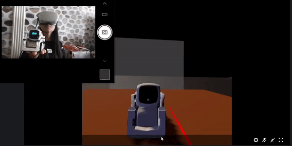
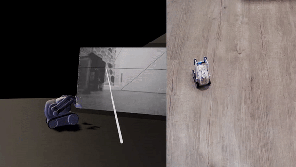
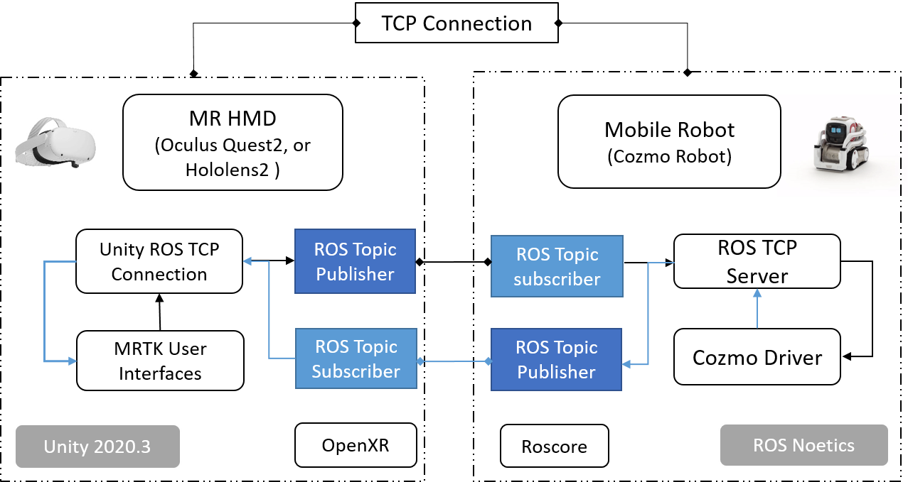

# MRCozmo 

This project explore to operate the [Anki Cozmo](https://www.digitaldreamlabs.com/pages/cozmo) robot in mixed reality (MR) and virtual reality (VR) using OpenXR supported head mounted display (HMD) such as Microsoft Hololens and Oculus Quest 2. 

This document demonstrates some examples and record the future development steps. 

[! Please note that this repository is under continuous development and improvement. Only the functionalities in the ```MainDemoScene``` scene is working. But please feel free to explore other work in progress code base as well!]

## Table of Contents
------------------
[Mixed Reality (Hololens2) Demos](#Hololens2)   

[Virtual Reality (Oculus Quest 2 + Passthrough API) Demos](#Quest2)


[System architecture](#Architecture)


## Mixed Reality Hololens 2 Demos  <a name="Hololens2"></a>
--------------------

### New Hololens2 UI layout:
--------------


### Live control of Cozmo Head via Hololens 2 by tracking Index finger tip and index finger knuckle :

--------------


### Live control of Cozmo Lift via Hololens 2 by tracking Index finger tip and tip of the thumb:

--------------


### ROS IP with Mixed Reality Keyboard Input:
--------------


## Virtual Reality (Oculus Quest 2 + Passthrough API) Demos  <a name="Quest2"></a>

### Raycast way point selection and path following  
-------------


### MR Robot Path Planning using Oculus Quest 2 Passthrough API 
------


### Free hand path planning and drawing in VR:
--------------



### Free Hand Lift Control Using [Hololens One Hand Ruler](https://github.com/HiromuKato/MRTK_HKSample)  <a name="freehandLift"></a>


### In simulation in Unity editor or in VR:
--------------



### Lift Control with VR controller 
----------------


### Turning head angle with VR headset
--------------


### Live 2D video streaming  
----------------


## System Architecture <a name="Architecture"></a>
-------------------
The robot model was imported to Unity using [URDF Importer](https://github.com/Unity-Technologies/Unity-Robotics-Hub/blob/main/tutorials/urdf_importer/urdf_tutorial.md)


The communcication between ROS and HMD is built on top of the [Unity ROS TCP Connector](https://github.com/Unity-Technologies/ROS-TCP-Connector) 




----


Learn more about this project from our contribution at the 5th International Workshop on Virtual, Augmented, and Mixed Reality for HRI ( [VAM-HRI 2022](https://vam-hri.github.io/)): https://openreview.net/pdf?id=HYIes841hJc

If you find this repository useful for your research and work, please cite this work: 

```bibtex
@inproceedings{Li2022TowardsRE,
  title={Towards Robust Exocentric Mobile Robot Tele-Operation in Mixed Reality},
  author={Ke Li and Reinhard Bacher and Wim P. Leemans and Frank Steinicke},
  year={2022}
}
```